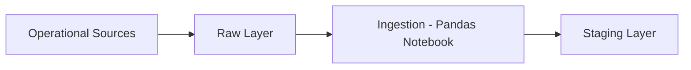
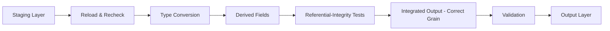
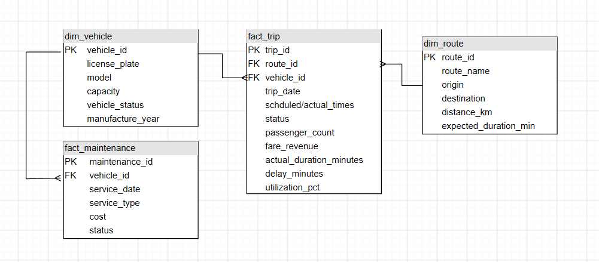
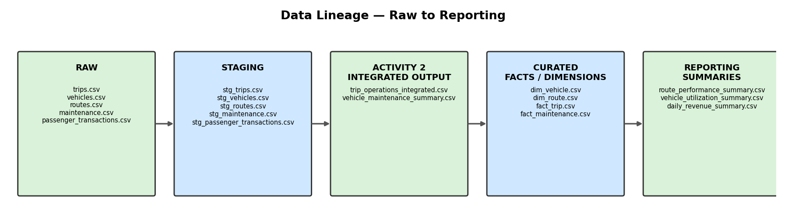
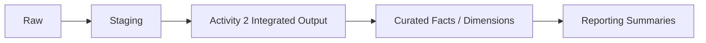

# City Transportation Data Platform

**Data Engineer Track — Midterm Activity 1 — Phase 1**
**Author:** Libron, Christian Isaac Andas
**Date:** September 10, 2026

---

## Task 1 — Business Scenario

A city government is building a unified data platform for public transportation operations. Data currently lives in five separate operational systems — vehicles, routes, trips, passenger transactions, and maintenance — with no way to analyze them together. The Transportation Office ultimately wants to answer questions about passenger demand, vehicle utilization, delays, maintenance needs, and fare revenue.

**Problem being solved:** the organization lacks a unified platform to combine fragmented systems, which blocks any holistic view of demand, utilization, delays, maintenance, and revenue.

**Who uses the data:** the Transportation Office.

**Future business questions this platform should eventually answer:**
- Which routes have the highest passenger volume?
- Which vehicles experience repeated maintenance issues?
- Which trips frequently exceed expected travel duration?
- How heavily is each vehicle utilized?
- What is the daily fare revenue by route?

---

## Phase 1 Objectives

- Understand the business problem and identify the operational source systems
- Identify entities, identifiers, and relationships among the systems
- Design the schema and data dictionary for each source
- Create realistic raw source records
- Organize `raw/`, `staging/`, `output/`, and `notebook/` folders
- Programmatically ingest all five source files
- Verify successful ingestion and perform basic structural/schema checks
- Save staging copies — no transformation or integration yet

---

## Source Systems

| Source System | Purpose | Main Identifier | Related System(s) |
|---|---|---|---|
| **Vehicle Registry** | Tracks physical vehicle fleet metadata, capacities, and operational statuses | `vehicle_id` | Trip Operations, Maintenance System |
| **Route Management** | Defines static route pathways, origins, destinations, distances, and travel baselines | `route_id` | Trip Operations |
| **Trip Operations** | Logs individual transit service runs, scheduled vs. actual timestamps, and run statuses | `trip_id` | Vehicle Registry, Route Management, Passenger Transactions |
| **Passenger Transactions** | Records individual fare payments, tap timestamps, card tokens, and revenue amounts | `transaction_id` | Trip Operations |
| **Maintenance System** | Logs vehicle repair history, mechanical issues, repair costs, and job completion states | `maintenance_id` | Vehicle Registry |

**Connecting fields:**
- `vehicle_id` → links **Vehicle Registry** to **Trip Operations** and **Maintenance System**
- `route_id` → links **Route Management** to **Trip Operations**
- `trip_id` → links **Trip Operations** to **Passenger Transactions**

---

## Task 2 — Entity Relationship Diagram


## Task 3 — Data Dictionary


## Task 4 — Primary & Foreign Keys

| Source | Primary Key | Foreign Key(s) | Relationship |
|---|---|---|---|
| `routes` | `route_id` | — | One route → many trips |
| `vehicles` | `vehicle_id` | — | One vehicle → many trips; one vehicle → many maintenance records |
| `trips` | `trip_id` | `route_id` → routes, `vehicle_id` → vehicles | One trip → many passenger transactions |
| `passenger_transactions` | `transaction_id` | `trip_id` → trips | Many transactions → one trip |
| `maintenance` | `maintenance_id` | `vehicle_id` → vehicles | Many maintenance records → one vehicle |

---

## Task 5 — Raw Data

Approximately 15 realistic records were created per source (~75 raw records total) in `raw/*.csv`, with identifiers kept consistent across sources so relationships can be tested once integration begins.

---

## Task 6 — Project Structure

```
OOP_DataEngineeringProject/
├── raw/                          # Original, untouched source files
│   ├── routes.csv
│   ├── vehicles.csv
│   ├── trips.csv
│   ├── passenger_transactions.csv
│   └── maintenance.csv
├── staging/                      # Ingested, unmodified copies
│   ├── stg_routes.csv
│   ├── stg_vehicles.csv
│   ├── stg_trips.csv
│   ├── stg_passenger_transactions.csv
│   └── stg_maintenance.csv
├── output/                       # Phase 2 integrated outputs
│   ├── trip_operations_integrated.csv
│   ├── vehicle_maintenance_summary.csv
│   └── data_quality_report.csv
├── notebook/
│   └── 01_data_pipeline.ipynb    # Full Phase 1 + Phase 2 pipeline
└── README.md
```

*(Note: `output/` was empty at the end of Phase 1 as originally shown — it's populated above once Phase 2 runs.)*

---

## Task 7 — Ingestion Notebook

All five raw files are loaded independently with Pandas — **nothing is joined or combined** at this stage:

```python
import pandas as pd

routes = pd.read_csv('../raw/routes.csv')
vehicles = pd.read_csv('../raw/vehicles.csv')
trips = pd.read_csv('../raw/trips.csv')
passenger_transactions = pd.read_csv('../raw/passenger_transactions.csv')
maintenance = pd.read_csv('../raw/maintenance.csv')
```

Full notebook (Phase 1 + Phase 2): [`notebook/01_data_pipeline.ipynb`](./notebook/01_data_pipeline.ipynb)

---

## Task 8 — Ingestion Summary

| Source | Expected Records | Loaded Records | Columns | Status |
|---|---|---|---|---|
| routes | 15 | 15 | 6 | ✅ Success |
| vehicles | 15 | 15 | 6 | ✅ Success |
| trips | 15 | 15 | 7 | ✅ Success |
| passenger_transactions | 15 | 15 | 6 | ✅ Success |
| maintenance | 15 | 15 | 7 | ✅ Success |

All five sources ingested cleanly with `df.shape`, `df.head()`, and `df.info()` checks — no load errors, no unexpected row/column counts.

---

## Task 9 — Basic Schema Validation

A small `SchemaValidator` class checks each source's structure — required columns present, primary key present with no nulls/duplicates, and expected vs. actual Pandas dtype. **No values are cleaned or modified at this stage.**

**Primary key check** — all five sources came back clean (0 nulls, 0 duplicates):

| Source | Primary Key | Nulls | Duplicates |
|---|---|---|---|
| routes | `route_id` | 0 | 0 |
| vehicles | `vehicle_id` | 0 | 0 |
| trips | `trip_id` | 0 | 0 |
| passenger_transactions | `transaction_id` | 0 | 0 |
| maintenance | `maintenance_id` | 0 | 0 |

**Field-level type check** (only flagged mismatches shown — full table lives in the notebook):

| Field | Expected Type | Actual Type | Observation |
|---|---|---|---|
| `trips.scheduled_start_time` | `datetime64[ns]` | `str` | Loaded as plain text, not parsed as a datetime |
| `trips.actual_start_time` | `datetime64[ns]` | `str` | Loaded as plain text, not parsed as a datetime |
| `trips.actual_end_time` | `datetime64[ns]` | `str` | Loaded as plain text, not parsed as a datetime |
| `passenger_transactions.tap_timestamp` | `datetime64[ns]` | `str` | Loaded as plain text, not parsed as a datetime |
| `maintenance.service_date` | `datetime64[ns]` | `str` | Loaded as plain text, not parsed as a datetime |

Every other field matched its expected type exactly. **These date/timestamp mismatches are recorded for next week's cleaning pass — not fixed today.**

---

## Task 10 — Staging Layer

After ingestion and validation, an untouched copy of each source is written to `staging/`:

```
stg_routes.csv
stg_vehicles.csv
stg_trips.csv
stg_passenger_transactions.csv
stg_maintenance.csv
```

This closes out the Phase 1 flow:



---

## Short Reflection

**1. Why is it important for a Data Engineer to understand the business scenario before writing the pipeline?**
Without knowing what questions the Transportation Office eventually wants answered — route demand, vehicle utilization, delays, maintenance trends, fare revenue — it's easy to design a schema or pick identifiers that don't actually support those questions later. Understanding the scenario first shapes which fields matter, which keys need to stay consistent, and where data quality will matter most.

**2. Why should raw data be preserved instead of immediately modifying the original files?**
Raw data is the only unbiased record of what the source systems actually produced. If it's edited in place, there's no way to go back and check whether a downstream problem was caused by a transformation bug or by the source itself. Keeping `raw/` untouched means every later layer can be re-derived and re-checked against ground truth.

**3. What is the purpose of a staging layer?**
Staging is a safe, ingested checkpoint between raw files and any real transformation or integration work. It confirms the data was successfully read and structurally sound before anything gets cleaned, joined, or reshaped — so problems get caught early, in isolation, one source at a time.

**4. Which field or relationship in your scenario is likely to be the most important when the datasets are eventually integrated?**
`vehicle_id`, since it connects three of the five sources — Vehicle Registry, Trip Operations, and Maintenance System. It's the join key behind almost every future business question involving utilization and maintenance patterns, so its consistency matters more than any other identifier.

**5. What potential problem do you expect when you eventually combine your five source systems?**
Referential integrity gaps — a `trip_id` in `passenger_transactions` or a `vehicle_id` in `maintenance` that doesn't exist (or no longer exists) in its parent source. Canceled trips (like `T1008`, with blank `actual_start_time`/`actual_end_time`) are also a likely source of nulls that will need explicit handling once trips and transactions are joined.

---

## Phase 1 Deliverables Checklist

- [x] Business requirement analysis
- [x] Source-system identification table
- [x] Entity relationship diagram
- [x] Five data dictionaries
- [x] Primary/foreign key documentation
- [x] Five raw datasets (`raw/*.csv`)
- [x] Raw / staging / output / notebook folder structure
- [x] Python ingestion notebook (`.ipynb`)
- [x] Ingestion summary
- [x] Basic schema validation
- [x] Five staging datasets (`staging/stg_*.csv`)


---

# Phase 2 — Transform, Validate & Integrate

**Data Engineer Track — Midterm Activity 2 — Phase 2**
**Author:** Libron, Christian Isaac Andas
**Date:** September 15, 2026

## Business Scenario — Phase 2

Staging copies exist for all five sources. Management now needs a reliable **trip-level operational table** — without losing each vehicle's separate maintenance history. Phase 2 picks up exactly where Phase 1 ended: staging data gets reloaded, transformed, validated, and integrated into the required analytical outputs. **The raw layer is preserved, and every correction/transformation is reproducible through code.**

## Phase 2 Objectives

- Load all five staging files created in Phase 1
- Apply necessary type, format, and value standardization through code
- Test primary-key and foreign-key integrity
- Identify and report orphan or unmatched records rather than silently deleting them
- Control the grain of each integrated output and avoid accidental row multiplication
- Aggregate one-to-many child records before joining when needed
- Create useful derived fields for the business scenario
- Validate row counts and duplicate behavior before and after integration
- Save clean integrated outputs and a compact data-quality report

## Source Files Continued From Phase 1

| Staging File | Role in Integration |
|---|---|
| `stg_vehicles.csv` | Vehicle attributes and capacity |
| `stg_routes.csv` | Route information and expected travel duration |
| `stg_trips.csv` | Core trip records linking vehicles and routes |
| `stg_passenger_transactions.csv` | Passenger-level fare transactions linked to trips |
| `stg_maintenance.csv` | Vehicle maintenance records linked to vehicles |

---

## Task 1 — Load and Recheck the Staging Layer

All five staging files are reloaded (not the raw files), a starting summary is built, and primary keys are rechecked before any transformation begins.

**Starting summary:**

| File | Row Count | Column Count | Primary Key |
|---|---|---|---|
| stg_routes.csv | 15 | 6 | `route_id` |
| stg_vehicles.csv | 15 | 6 | `vehicle_id` |
| stg_trips.csv | 15 | 7 | `trip_id` |
| stg_passenger_transactions.csv | 15 | 6 | `transaction_id` |
| stg_maintenance.csv | 15 | 7 | `maintenance_id` |

**Primary-key recheck (nulls / duplicates):** all five sources came back clean — 0 nulls, 0 duplicates across every primary key.

---

## Task 2 — Apply Required Transformations

Only the transformations needed to make the sources joinable and analytically usable were performed — no full data-quality cleanup.

### Type conversion

A `SchemaTransform` class converts each source's fields in place: datetime fields (`scheduled_start_time`, `actual_start_time`, `actual_end_time`, `tap_timestamp`, `service_date`) to `datetime64`, numeric fields (`capacity`, `distance_km`, `expected_duration_min`, `fare_amount`, `cost`, `manufacture_year`) to numeric types, and text fields to `str`. Verified afterward with the same `type_report()` pattern from Phase 1 — every field converted as intended.

### Derived fields

No extra DataFrame is created — every derived field is added as a new column directly onto `trans_trips_df`:

| Derived field | Source(s) needed | Computed as |
|---|---|---|
| `actual_duration_minutes` | `trips` alone | `actual_end_time − actual_start_time`, in minutes |
| `passenger_count`, `fare_revenue` | `passenger_transactions`, aggregated by `trip_id` | Count and sum, joined onto trips |
| `delay_minutes` | `trips` + `routes.expected_duration_min` | `actual_duration_minutes − expected_duration_min` |
| `utilization_pct` | `trips` + `vehicles.capacity` | `passenger_count / capacity × 100` |

The cancelled trip (`T1008`) correctly comes out with `passenger_count = 0`, `fare_revenue = 0`, and a null duration/delay, since it never actually ran. No trip currently exceeds 100% utilization — if one did, it would mean more fare taps were recorded than seats existed (standees, double taps, etc.), not necessarily a data error, but worth flagging for review.

---

## Task 3 — Referential-Integrity Tests

A `ForeignKeyValidator` class checks whether each foreign key resolves to a real parent record. **Orphans are reported, never silently dropped.**

| Rule | Affected Rows | Status / Action |
|---|---|---|
| `trips.vehicle_id` → `vehicles.vehicle_id` | 0 | No orphan foreign keys found |
| `trips.route_id` → `routes.route_id` | 0 | No orphan foreign keys found |
| `passenger_transactions.trip_id` → `trips.trip_id` | 0 | No orphan foreign keys found |
| `maintenance.vehicle_id` → `vehicles.vehicle_id` | 0 | No orphan foreign keys found |

All four relationships are clean — no unmatched foreign keys anywhere in the dataset.

---

## Task 4 — Build the Integrated Output at the Correct Grain

**Intended grain: one row per trip.** `passenger_transactions` was aggregated by `trip_id` *before* being joined (see Task 2), so joining it never multiplied trip rows. Route and vehicle attributes are one-to-one against trips, so those joins carried no multiplication risk either.

`trip_operations_integrated` is built by joining route attributes (`route_name`, `origin`, `destination`, `distance_km`) and vehicle attributes (`license_plate`, `model`, `manufacture_year`, `vehicle_status`) onto the already-enriched trips table. Row counts were checked before and after every join — 15 rows in, 15 rows out, every time. `trip_id` remains unique.

Maintenance is a separate one-to-many relationship against **vehicles** (not trips), so it's summarized independently rather than joined into the trip-level table.

---

## Task 5 — Validate the Integration

| Check | Affected Rows | Status |
|---|---|---|
| `trip_id` uniqueness at trip grain | 0 | ✅ No issues found |
| Missing values introduced by the routes/vehicles joins (8 columns checked) | 0 | ✅ No issues found |
| `actual_duration_minutes < 0` | 0 | ✅ No issues found |
| `fare_revenue < 0` | 0 | ✅ No issues found |
| `passenger_count < 0` | 0 | ✅ No issues found |
| `utilization_pct < 0` | 0 | ✅ No issues found |

Every validation check passed. Nothing was silently corrected — this is what the checks actually found, not an assumption.

---

## Task 6 — Business Validation Queries

**1. Top 3 routes by total `passenger_count` and total `fare_revenue`:**
- By passenger count: R01 Downtown Express (3), R02 Crosstown Shuttle (1), R03 Airport Connector (1)
- By fare revenue: R01 Downtown Express ($8.25), R03 Airport Connector ($5.00), R13 Suburb Rapid ($4.50)

**2. Trips with positive `delay_minutes`, largest delays first:**
A three-way tie at 15 minutes leads the list — **T1002** (R01/V102), **T1004** (R03/V103), **T1003** (R02/V104). All 13 completed trips ran late by some amount; none arrived early or exactly on time.

**3. Vehicles with the highest `maintenance_count` or `total_maintenance_cost`:**
- By count: **V103** (3 records, $1,620 total)
- By cost: **V108** ($2,710 across only 2 records — costlier per visit than V103)

---

## Task 7 — Save the Phase 2 Outputs

Three files saved to `output/` with `index=False`:

| File | Rows | Purpose |
|---|---|---|
| `trip_operations_integrated.csv` | 15 | One row per trip — route, vehicle, passenger, revenue, duration, delay, and utilization fields |
| `vehicle_maintenance_summary.csv` | 11 | One row per vehicle — maintenance count, total cost, latest service date, completed/pending counts |
| `data_quality_report.csv` | 18 | Combined referential-integrity (Task 3) and integration validation (Task 5) results |



---

## Short Reflection — Phase 2

**1. Which join in your scenario had the highest risk of creating duplicate or multiplied rows? Why?**
The join between `trips` and `passenger_transactions` carried the highest risk. This is because `passenger_transactions` is at transaction grain, which means multiple rows can share the same `trip_id`, which is why joining it directly onto `trips` would have produced one trip row per matching transaction instead of one row per trip, multiplying the trip table — which is not what we want. That's why it was aggregated by `trip_id` (`passenger_count`, `fare_revenue`) before being joined, rather than joined raw.

**2. What foreign-key problem would be most damaging to the final analytical output?**
The most damaging foreign-key problem would be an orphaned `passenger_transactions.trip_id`. This is because a fare transaction that doesn't match any real trip would indicate that fare revenue tied to that orphaned transaction would either be silently dropped from the trip-level totals or counted in overall revenue figures without ever being traced to a specific route or vehicle, which is worse.

**3. Why is the grain of an integrated table important in data engineering?**
Grain is incredibly important since the grain defines what one row means. Every derived metric such as `fare_revenue`, `passenger_count`, `utilization_pct`, is only correct because `trip_operations_integrated` is guaranteed to be one row per trip. If a join accidentally multiplied that to two rows for one trip, `fare_revenue` would silently double for that trip with no error thrown. The table would still run, still produce numbers, but as we have already learned in OOP, code that runs doesn't always mean it is correct.

**4. Which transformation or validation rule would you automate first if this pipeline ran every day?**
I would automate the referential-integrity checks from Task 3, the `ForeignKeyValidator`. This is because it catches the most damaging class of problem, which are orphaned foreign keys silently corrupting revenue and utilization figures, which was also stated in the second question. Another reason is also because from a business point of view, it is cheap to run.

---

## Phase 2 Deliverables Checklist

- [x] Staging layer reloaded and rechecked (row/column/PK summary, PK null/duplicate recheck)
- [x] Type conversion applied through code (`SchemaTransform`)
- [x] Derived fields created (`passenger_count`, `fare_revenue`, `actual_duration_minutes`, `delay_minutes`, `utilization_pct`)
- [x] Primary/foreign-key integrity checks (`ForeignKeyValidator`, 4 rules, 0 orphans)
- [x] Integrated output built at the correct grain (`trip_operations_integrated.csv`)
- [x] Integration validated (uniqueness, missingness, impossible values)
- [x] Business validation queries answered
- [x] `vehicle_maintenance_summary.csv` and `data_quality_report.csv` saved
- [x] Original raw and staging files retained unchanged
- [x] Short reflection


---

# Phase 3 — Analytics / Data-Mart Layer

**Data Engineer Track — Midterm Activity 3 — Phase 3**
**Author:** Libron, Christian Isaac Andas
**Date:** September 22, 2026

## Business Scenario — Phase 3

Trip operations are already integrated with vehicle/route information, and maintenance
history is preserved separately. Phase 3 organizes these outputs into a small **reporting
mart** that supports route demand, trip performance, fare revenue, vehicle utilization, and
maintenance monitoring — without mixing incompatible grains. This is the final technical
build before the formal project document: not a dashboard, but a clean, documented analytics
layer other users can trust.

## Phase 3 Objectives

- Design a small analytics/data-mart layer from the validated Activity 2 outputs
- Separate facts and dimensions according to their correct grain
- Preserve one-to-many relationships without double-counting measures
- Create reusable pipeline functions with clearly organized transformation steps
- Implement automated validation/reconciliation checks
- Produce management-ready summary tables from the curated layer
- Document simple data lineage from staging to final outputs
- Save final curated datasets that can support the project report

## Inputs Continued From Phase 2

| Input | Purpose |
|---|---|
| `trip_operations_integrated.csv` | Activity 2 trip-level integrated output |
| `vehicle_maintenance_summary.csv` | Activity 2 vehicle maintenance summary |
| `stg_vehicles.csv` | Vehicle master |
| `stg_routes.csv` | Route master |
| `stg_maintenance.csv` | Maintenance records at service-event grain |

---

## Task 1 — Recheck Phase 2 Outputs

All five inputs above are reloaded (Activity 1 raw files and Activity 2 outputs are never
modified) and rechecked with an `InputRecheck` class — row counts, primary-key nulls/
duplicates, expected columns, and critical-column nulls. All five came back clean.

**Intended grain of every input, recorded before building anything on top of it:**

| Input | Grain |
|---|---|
| `trip_operations_integrated.csv` | One row per `trip_id` |
| `vehicle_maintenance_summary.csv` | One row per `vehicle_id` |
| `stg_vehicles.csv` | One row per `vehicle_id` |
| `stg_routes.csv` | One row per `route_id` |
| `stg_maintenance.csv` | One row per `maintenance_id` (a vehicle can have many) |

---

## Task 2 — Design the Analytics Layer

Two dimensions hold descriptive attributes once each; two facts hold measures at their own
grain and reference the dimensions by key. `fact_trip` and `fact_maintenance` never join
directly to each other — both only join *out* to `dim_vehicle` (and `fact_trip` also to
`dim_route`) — which is what keeps the trip grain and the maintenance-event grain from ever
being multiplied together.

| Curated Table | Grain / Purpose |
|---|---|
| `dim_vehicle.csv` | One row per `vehicle_id` |
| `dim_route.csv` | One row per `route_id` |
| `fact_trip.csv` | One row per `trip_id` — route/vehicle keys, duration, passenger count, fare revenue, delay/utilization fields |
| `fact_maintenance.csv` | One row per `maintenance_id` — vehicle key, service date, service type, cost, status |

**Note on `odometer`:** the assignment's required grain for `fact_maintenance` lists an
`odometer` field, but no odometer reading exists anywhere in the raw/staging source data.
Rather than fabricate a value, `fact_maintenance` omits it — this gap is flagged for the
source system rather than silently invented.

### Star-schema diagram



---

## Task 3 — Reusable Transformation Steps

Each dimension/fact is built by its own small function — `build_dim_vehicle`,
`build_dim_route`, `build_fact_trip`, `build_fact_maintenance` — with explicit join keys and
consistent naming, following the same *load → validate → transform → aggregate → save*
structure used in the Phase 2 notebook. Curated outputs are saved to a new `curated/` folder,
kept separate from `raw/`, `staging/`, and the Phase 2 `output/` folder.

---

## Task 4 — Automated Data-Quality Checks

A `QualityCheck` class wraps any check function into a PASS/FAIL row with an affected-row
count, saved as `phase3_quality_report.csv`.

| Check | Affected Rows | Status |
|---|---|---|
| `fact_trip.vehicle_id` exists in `dim_vehicle` | 0 | ✅ PASS |
| `fact_trip.route_id` exists in `dim_route` | 0 | ✅ PASS |
| `fact_maintenance.vehicle_id` exists in `dim_vehicle` | 0 | ✅ PASS |
| `trip_id` unique in `fact_trip` | 0 | ✅ PASS |
| `maintenance_id` unique in `fact_maintenance` | 0 | ✅ PASS |
| Passenger/fare aggregates reconcile with Activity 2 trip-level output | 0 | ✅ PASS |
| Maintenance cost not multiplied by trip joins | 0 | ✅ PASS |

The last check is the one most specific to star-schema design: it guards against the classic
bug of joining a per-event fact (maintenance) onto a per-trip fact and summing cost, which
would multiply the true cost by however many trips that vehicle happened to run. It compares
`vehicle_utilization_summary.maintenance_cost` against a maintenance-only groupby computed
independently of any trip join.

---

## Task 5 — Management-Ready Summary Tables

Each summary is generated purely from the curated `dim_*`/`fact_*` layer through code.

| Summary | Purpose |
|---|---|
| `route_performance_summary.csv` | Trips, passengers, fare revenue, average duration, and delay rate by route |
| `vehicle_utilization_summary.csv` | Trips, passengers carried, utilization measure(s), and maintenance cost by vehicle |
| `daily_revenue_summary.csv` | Fare revenue and passenger transactions by trip date |

Both summaries start from the full dimension (`dim_route`/`dim_vehicle`) rather than only the
routes/vehicles that happen to appear in the facts, so a route or vehicle with zero activity
still shows up with `0`s instead of silently disappearing. Two real examples this surfaced:
**R15 (Stadium Shuttle)** has zero trips in this batch, and **V113** has maintenance history
but no completed trips.

---

## Task 6 — Reconcile the Curated Layer

| Measure Reconciled | Activity 2 Total | Phase 3 Total | Difference | Explanation |
|---|---|---|---|---|
| Total trip count | 15 | 15 | 0 | `fact_trip` is a direct, unfiltered re-projection of `trip_operations_integrated` at the same `trip_id` grain |
| Total fare revenue | 42.5 | 42.5 | 0 | `fare_revenue` is carried over unchanged from Activity 2; no re-aggregation happens before this total |
| Total passenger count | 15 | 15 | 0 | `passenger_count` is carried over unchanged from Activity 2 for the same reason as fare revenue |
| Total maintenance cost | 7175.0 | 7175.0 | 0 | Both totals sum the same `stg_maintenance` records — `vehicle_maintenance_summary` rolls them up by vehicle first, `fact_maintenance` keeps event grain, but the grand total is identical either way |

---

## Task 7 — Final Business Checks

**1. Which routes carry the most passengers and generate the most fare revenue?**
`R13` Suburb Rapid leads on fare revenue thanks to its long distance; most routes tie on
passenger count since each ran only one trip in this batch — with more days of data this
comparison will separate real demand leaders from one-off trips.

**2. Which routes or trips show the highest delay frequency or excess duration?**
Every completed trip ran on a route with only one trip, so `delay_rate_pct` is either 0% or
100% per route. Trip `T1002` on `R01` has the single largest individual delay (15 minutes
over its 45-minute expected duration).

**3. Which vehicles combine high utilization with repeated or costly maintenance?**
`V108` has the highest maintenance cost (an in-progress engine failure plus a completed
electrical repair) but zero trips this batch since its trip was cancelled — a maintenance
risk to watch even though it isn't currently utilized. `V103` has the most repeated
maintenance events (3) while shown mid-trip as `Under Maintenance`.

---

## Task 8 — Data Lineage





---

## Final Project Structure

```
OOP_DataEngineeringProject/
├── raw/                                # Activity 1 - untouched
├── staging/                            # Activity 1 - untouched
├── output/                             # Activity 2 outputs - untouched
│   ├── trip_operations_integrated.csv
│   ├── vehicle_maintenance_summary.csv
│   └── data_quality_report.csv
├── curated/                            # Phase 3 - data-mart layer
│   ├── dim_vehicle.csv
│   ├── dim_route.csv
│   ├── fact_trip.csv
│   ├── fact_maintenance.csv
│   ├── route_performance_summary.csv
│   ├── vehicle_utilization_summary.csv
│   ├── daily_revenue_summary.csv
│   ├── phase3_quality_report.csv
│   └── reconciliation_report.csv
├── diagrams/                           # Phase 3 - star schema + lineage
│   ├── star_schema_diagram.png
│   └── data_lineage_diagram.png
├── notebook/
│   ├── 01_data_pipeline.ipynb          # Phase 1 + Phase 2
│   └── 02_data_mart.ipynb              # Phase 3
└── README.md
```

---

## Short Reflection — Phase 3

**1. Why did your project require more than one grain or more than one fact table?**
Trips and maintenance events happen at different frequencies and describe different things —
a trip is one scheduled movement of one vehicle, a maintenance record is one service event
for a vehicle that can occur any number of times, independent of how many trips that vehicle
ran. Forcing both into a single trip-grain table would mean either dropping maintenance
history that doesn't line up with a specific trip, or repeating (and effectively multiplying)
maintenance cost across every trip that vehicle happens to make. Two fact tables —
`fact_trip` and `fact_maintenance` — each stay at the grain their own source events actually
occur at.

**2. Which reconciliation check gives you the most confidence that the curated layer is correct?**
The passenger/fare reconciliation against the Activity 2 trip-level output. It compares
totals for the two measures the whole mart exists to report on, computed two different ways
(Activity 2's integration logic vs. Phase 3's straight re-projection into `fact_trip`), so any
silent row loss, duplication, or mis-join anywhere upstream of `fact_trip` would show up
immediately as a mismatch.

**3. What measure would be easiest to double-count if the data mart were designed incorrectly?**
`maintenance cost`. Because one vehicle can have many trips and many maintenance events, a
naive join of `fact_trip` to maintenance records on `vehicle_id` produces one row per
(trip × maintenance event) pair for that vehicle — summing `cost` over that join multiplies
the true cost by however many trips the vehicle happened to run. This is exactly what the
`check_maintenance_cost_not_multiplied` check in Task 4 guards against.

**4. If this pipeline ran daily, which step would you automate or monitor first?**
The Task 4 quality checks — specifically the foreign-key checks and the passenger/fare
reconciliation. Those are the checks most likely to catch a real upstream problem (a vehicle
retired without updating `dim_vehicle`, a route renamed inconsistently, a duplicated
extraction from `passenger_transactions`) before it reaches management-facing summaries, and
they're cheap to run automatically on every load with no manual judgment required.

---

## Phase 3 Deliverables Checklist

- [x] Activity 2 outputs and staging inputs rechecked (row counts, keys, nulls, grain)
- [x] Star-schema data-mart design (`dim_vehicle`, `dim_route`, `fact_trip`, `fact_maintenance`)
- [x] Reusable transformation functions, clearly separated by stage
- [x] Automated data-quality checks (`phase3_quality_report.csv`, 7 checks, 0 failures)
- [x] Management-ready summary tables (route, vehicle, daily revenue)
- [x] Reconciliation against Activity 2 totals (4 measures, 0 differences)
- [x] Star-schema diagram (`diagrams/star_schema_diagram.png`)
- [x] Data-lineage diagram (`diagrams/data_lineage_diagram.png`)
- [x] Business-check results with interpretation
- [x] Curated outputs saved to `curated/`, separate from `raw/`/`staging/`/`output/`
- [x] Original raw, staging, and Activity 2 output files retained unchanged
- [x] Short reflection
