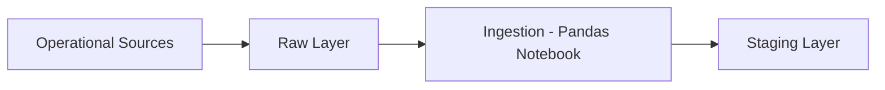

# City Transportation Data Platform

**Data Engineer Track — Midterm Activity 1 — Phase 1**
**Author:** Libron, Christian Isaac Andas
**Date:** September 10, 2026

---

## Task 1 — Business Scenario

A city government is building a unified data platform for public transportation operations. Data currently lives in five separate operational systems — vehicles, routes, trips, passenger transactions, and maintenance — with no way to analyze them together. The Transportation Office ultimately wants to answer questions about passenger demand, vehicle utilization, delays, maintenance needs, and fare revenue.

**Problem being solved:** the organization lacks a unified platform to combine fragmented systems, which blocks any holistic view of demand, utilization, delays, maintenance, and revenue.

**Who uses the data:** the Transportation Office.

**Future business questions this platform should eventually answer:**
- Which routes have the highest passenger volume?
- Which vehicles experience repeated maintenance issues?
- Which trips frequently exceed expected travel duration?
- How heavily is each vehicle utilized?
- What is the daily fare revenue by route?

---

## Phase 1 Objectives

- Understand the business problem and identify the operational source systems
- Identify entities, identifiers, and relationships among the systems
- Design the schema and data dictionary for each source
- Create realistic raw source records
- Organize `raw/`, `staging/`, `output/`, and `notebook/` folders
- Programmatically ingest all five source files
- Verify successful ingestion and perform basic structural/schema checks
- Save staging copies — no transformation or integration yet

---

## Source Systems

| Source System | Purpose | Main Identifier | Related System(s) |
|---|---|---|---|
| **Vehicle Registry** | Tracks physical vehicle fleet metadata, capacities, and operational statuses | `vehicle_id` | Trip Operations, Maintenance System |
| **Route Management** | Defines static route pathways, origins, destinations, distances, and travel baselines | `route_id` | Trip Operations |
| **Trip Operations** | Logs individual transit service runs, scheduled vs. actual timestamps, and run statuses | `trip_id` | Vehicle Registry, Route Management, Passenger Transactions |
| **Passenger Transactions** | Records individual fare payments, tap timestamps, card tokens, and revenue amounts | `transaction_id` | Trip Operations |
| **Maintenance System** | Logs vehicle repair history, mechanical issues, repair costs, and job completion states | `maintenance_id` | Vehicle Registry |

**Connecting fields:**
- `vehicle_id` → links **Vehicle Registry** to **Trip Operations** and **Maintenance System**
- `route_id` → links **Route Management** to **Trip Operations**
- `trip_id` → links **Trip Operations** to **Passenger Transactions**

---

## Task 2 — Entity Relationship Diagram


## Task 3 — Data Dictionary


## Task 4 — Primary & Foreign Keys

| Source | Primary Key | Foreign Key(s) | Relationship |
|---|---|---|---|
| `routes` | `route_id` | — | One route → many trips |
| `vehicles` | `vehicle_id` | — | One vehicle → many trips; one vehicle → many maintenance records |
| `trips` | `trip_id` | `route_id` → routes, `vehicle_id` → vehicles | One trip → many passenger transactions |
| `passenger_transactions` | `transaction_id` | `trip_id` → trips | Many transactions → one trip |
| `maintenance` | `maintenance_id` | `vehicle_id` → vehicles | Many maintenance records → one vehicle |

---

## Task 5 — Raw Data

Approximately 15 realistic records were created per source (~75 raw records total) in `raw/*.csv`, with identifiers kept consistent across sources so relationships can be tested once integration begins.

---

## Task 6 — Project Structure

```
OOP_DataEngineeringProject/
├── raw/                          # Original, untouched source files
│   ├── routes.csv
│   ├── vehicles.csv
│   ├── trips.csv
│   ├── passenger_transactions.csv
│   └── maintenance.csv
├── staging/                      # Ingested, unmodified copies
│   ├── stg_routes.csv
│   ├── stg_vehicles.csv
│   ├── stg_trips.csv
│   ├── stg_passenger_transactions.csv
│   └── stg_maintenance.csv
├── output/                       # Reserved for later phases (empty for now)
├── notebook/
│   └── 01_load_raw_data.ipynb    # Ingestion, validation & staging notebook
└── README.md
```

---

## Task 7 — Ingestion Notebook

All five raw files are loaded independently with Pandas — **nothing is joined or combined** at this stage:

```python
import pandas as pd

routes = pd.read_csv('../raw/routes.csv')
vehicles = pd.read_csv('../raw/vehicles.csv')
trips = pd.read_csv('../raw/trips.csv')
passenger_transactions = pd.read_csv('../raw/passenger_transactions.csv')
maintenance = pd.read_csv('../raw/maintenance.csv')
```

Full notebook: [`notebook/01_load_raw_data.ipynb`](./notebook/01_load_raw_data.ipynb)

---

## Task 8 — Ingestion Summary

| Source | Expected Records | Loaded Records | Columns | Status |
|---|---|---|---|---|
| routes | 15 | 15 | 6 | ✅ Success |
| vehicles | 15 | 15 | 6 | ✅ Success |
| trips | 15 | 15 | 7 | ✅ Success |
| passenger_transactions | 15 | 15 | 6 | ✅ Success |
| maintenance | 15 | 15 | 7 | ✅ Success |

All five sources ingested cleanly with `df.shape`, `df.head()`, and `df.info()` checks — no load errors, no unexpected row/column counts.

---

## Task 9 — Basic Schema Validation

A small `SchemaValidator` class checks each source's structure — required columns present, primary key present with no nulls/duplicates, and expected vs. actual Pandas dtype. **No values are cleaned or modified at this stage.**

**Primary key check** — all five sources came back clean (0 nulls, 0 duplicates):

| Source | Primary Key | Nulls | Duplicates |
|---|---|---|---|
| routes | `route_id` | 0 | 0 |
| vehicles | `vehicle_id` | 0 | 0 |
| trips | `trip_id` | 0 | 0 |
| passenger_transactions | `transaction_id` | 0 | 0 |
| maintenance | `maintenance_id` | 0 | 0 |

**Field-level type check** (only flagged mismatches shown — full table lives in the notebook):

| Field | Expected Type | Actual Type | Observation |
|---|---|---|---|
| `trips.scheduled_start_time` | `datetime64[ns]` | `str` | Loaded as plain text, not parsed as a datetime |
| `trips.actual_start_time` | `datetime64[ns]` | `str` | Loaded as plain text, not parsed as a datetime |
| `trips.actual_end_time` | `datetime64[ns]` | `str` | Loaded as plain text, not parsed as a datetime |
| `passenger_transactions.tap_timestamp` | `datetime64[ns]` | `str` | Loaded as plain text, not parsed as a datetime |
| `maintenance.service_date` | `datetime64[ns]` | `str` | Loaded as plain text, not parsed as a datetime |

Every other field matched its expected type exactly. **These date/timestamp mismatches are recorded for next week's cleaning pass — not fixed today.**

---

## Task 10 — Staging Layer

After ingestion and validation, an untouched copy of each source is written to `staging/`:

```
stg_routes.csv
stg_vehicles.csv
stg_trips.csv
stg_passenger_transactions.csv
stg_maintenance.csv
```

This closes out the Phase 1 flow:



---

## Short Reflection

**1. Why is it important for a Data Engineer to understand the business scenario before writing the pipeline?**
Without knowing what questions the Transportation Office eventually wants answered — route demand, vehicle utilization, delays, maintenance trends, fare revenue — it's easy to design a schema or pick identifiers that don't actually support those questions later. Understanding the scenario first shapes which fields matter, which keys need to stay consistent, and where data quality will matter most.

**2. Why should raw data be preserved instead of immediately modifying the original files?**
Raw data is the only unbiased record of what the source systems actually produced. If it's edited in place, there's no way to go back and check whether a downstream problem was caused by a transformation bug or by the source itself. Keeping `raw/` untouched means every later layer can be re-derived and re-checked against ground truth.

**3. What is the purpose of a staging layer?**
Staging is a safe, ingested checkpoint between raw files and any real transformation or integration work. It confirms the data was successfully read and structurally sound before anything gets cleaned, joined, or reshaped — so problems get caught early, in isolation, one source at a time.

**4. Which field or relationship in your scenario is likely to be the most important when the datasets are eventually integrated?**
`vehicle_id`, since it connects three of the five sources — Vehicle Registry, Trip Operations, and Maintenance System. It's the join key behind almost every future business question involving utilization and maintenance patterns, so its consistency matters more than any other identifier.

**5. What potential problem do you expect when you eventually combine your five source systems?**
Referential integrity gaps — a `trip_id` in `passenger_transactions` or a `vehicle_id` in `maintenance` that doesn't exist (or no longer exists) in its parent source. Canceled trips (like `T1008`, with blank `actual_start_time`/`actual_end_time`) are also a likely source of nulls that will need explicit handling once trips and transactions are joined.

---

## Phase 1 Deliverables Checklist

- [x] Business requirement analysis
- [x] Source-system identification table
- [x] Entity relationship diagram
- [x] Five data dictionaries
- [x] Primary/foreign key documentation
- [x] Five raw datasets (`raw/*.csv`)
- [x] Raw / staging / output / notebook folder structure
- [x] Python ingestion notebook (`.ipynb`)
- [x] Ingestion summary
- [x] Basic schema validation
- [x] Five staging datasets (`staging/stg_*.csv`)


